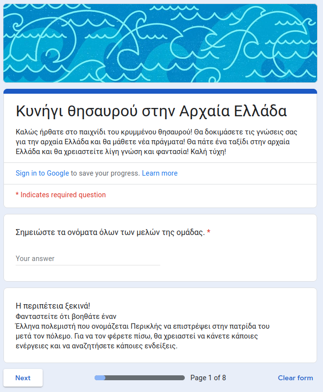
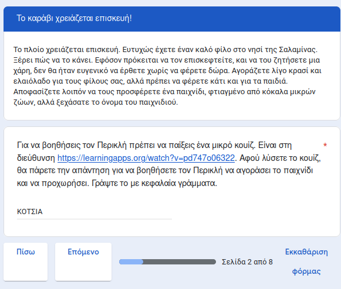
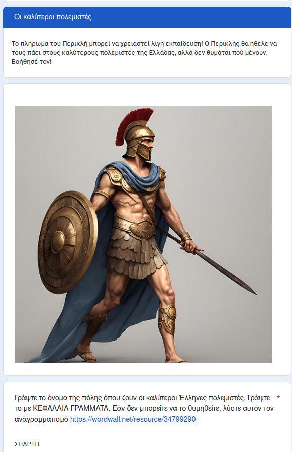
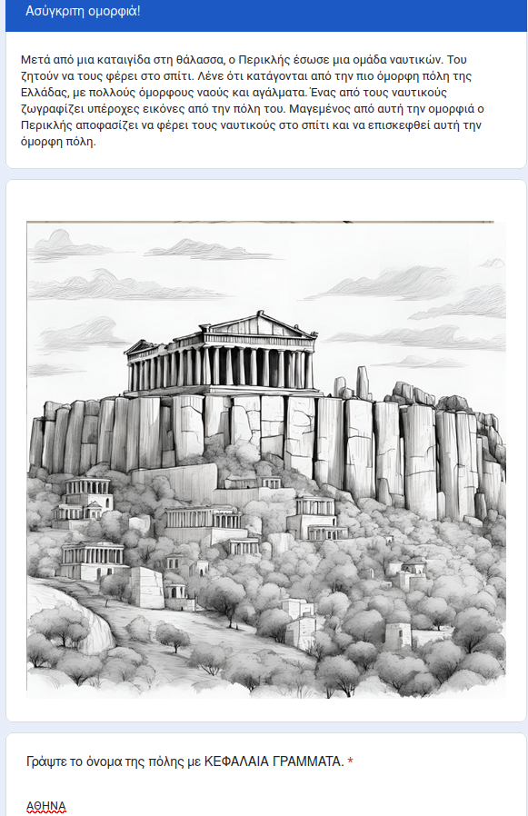
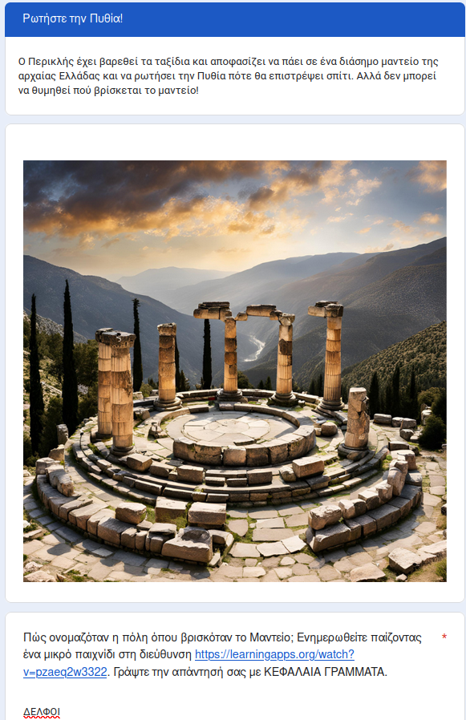
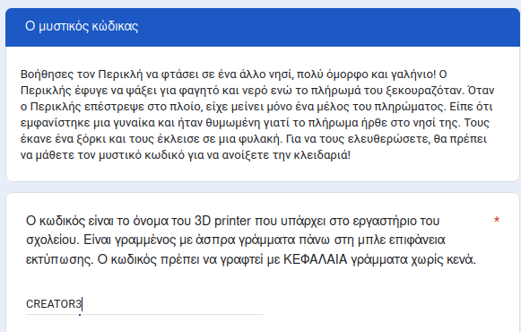
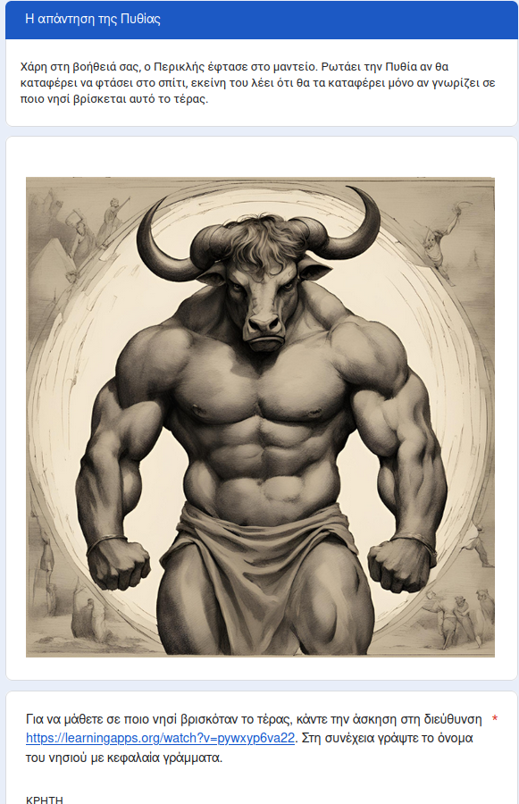
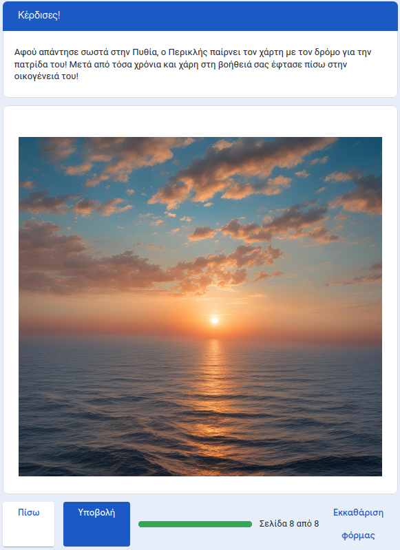

# Κυνήγι θησαυρού στην Αρχαία Ελλάδα

# Γενικές Πληροφορίες
Σκοπός αυτού του έργου είναι η παιγνιώδης ενασχόληση των μαθητών με την Ελληνική Μυθολογίας και Αρχαία Ελληνική Ιστορία. Πρόκειται για ένα διαδραστικό "δωμάτιο διαφυγής" όπου οι μαθητές προχωρούν σε μια σειρά από επίπεδα απαντώντας σε ερωτήσεις ή ανακαλύπτοντας στοιχεία μέσω της επίλυσης παιγνιωδών προκλήσεων.

Το δωμάτιο διαφυγής είναι φτιαγμένο σε google forms και μπορεί να το βρει κανείς στον σύνδεσμο https://forms.gle/tiazT2xd9o32V4ZVA, ενώ μπορεί να κάνει αντίγραφο για προσαρμογή χρησιμοποιοωντας τον σύνδεσμο https://docs.google.com/forms/d/1-VTkowIhQmB_p1D8RfXrKmHtdawsITkj0ym_PWeJhjU/copy

Αποτελείται από 7 επίπεδα 

# Επίπεδο 1

# Επίπεδο 2

# Επίπεδο 3

# Επίπεδο 4

# Επίπεδο 5

# Επίπεδο 6

# Επίπεδο 7

# Τέλος

Η διάθεση του έργου αυτού γίνεται με άδεια
[Creative Commons Αναφορά Δημιουργού - Μη Εμπορική Χρήση - Παρόμοια Διανομή 3.0 Ελλάδα (CC BY-NC-SA 3.0 GR)][cc-by-nc-sa].

[cc-by-nc-sa]: https://creativecommons.org/licenses/by-nc-sa/3.0/deed.el
